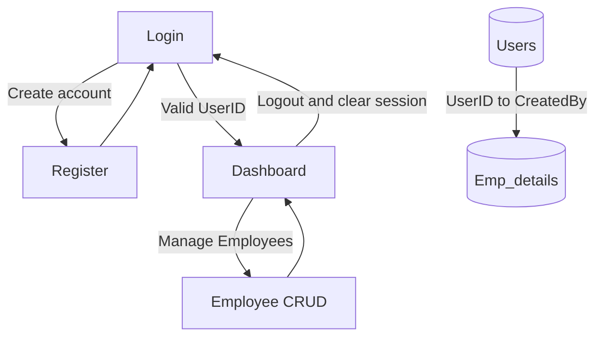
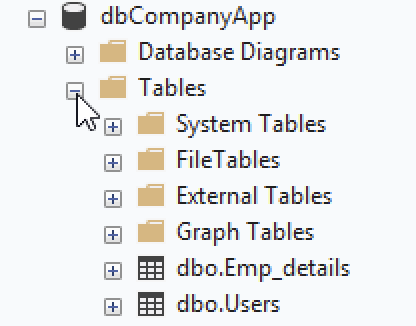
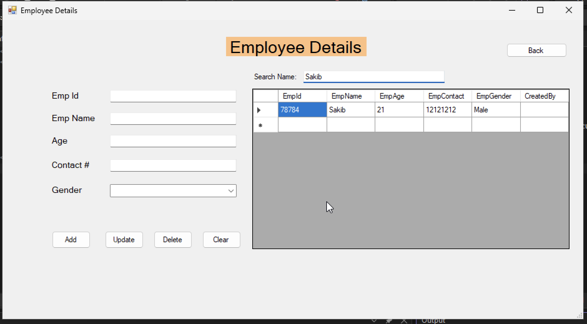
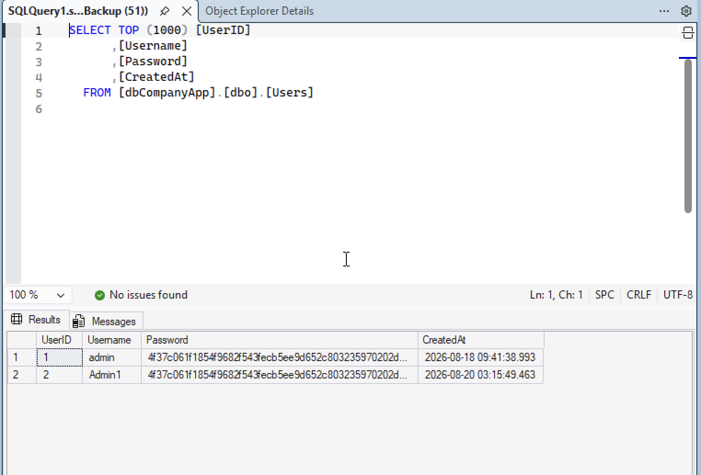
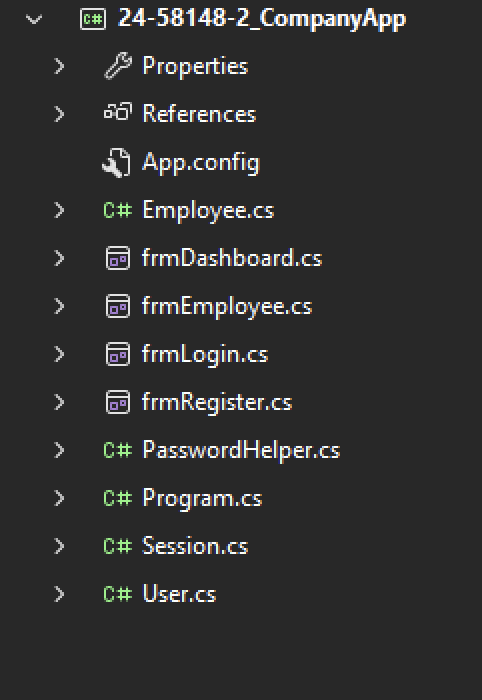
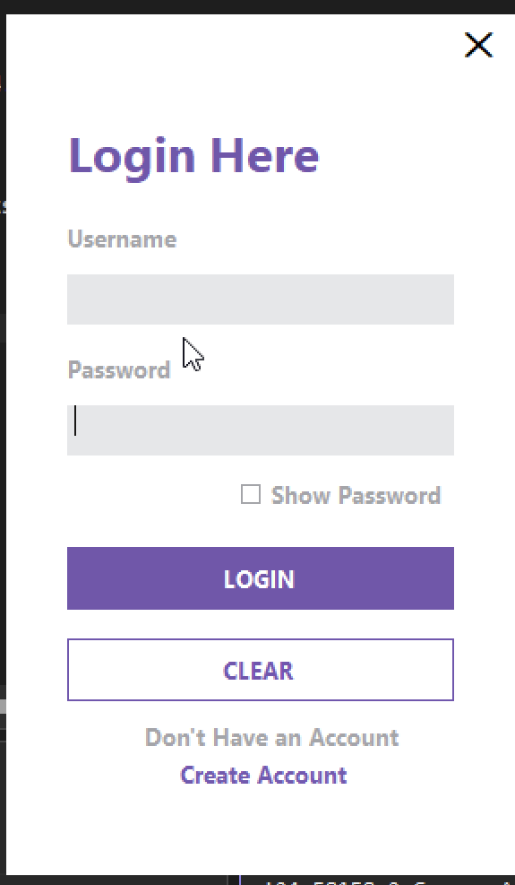
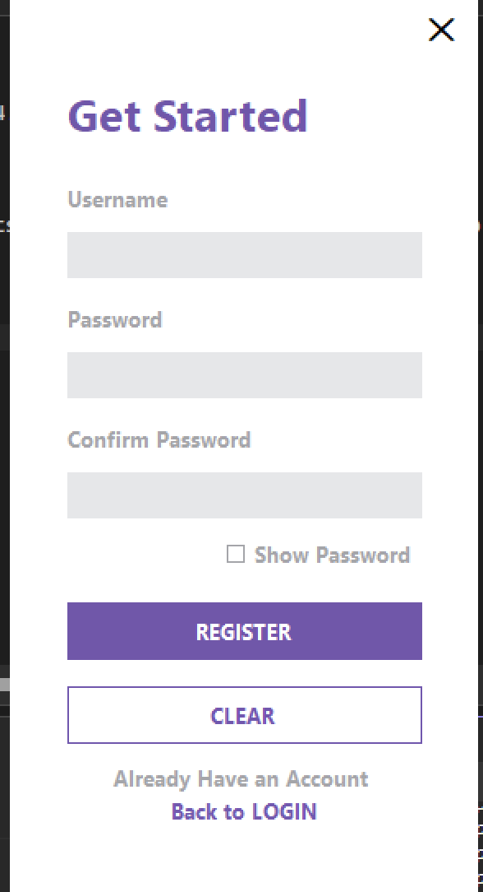
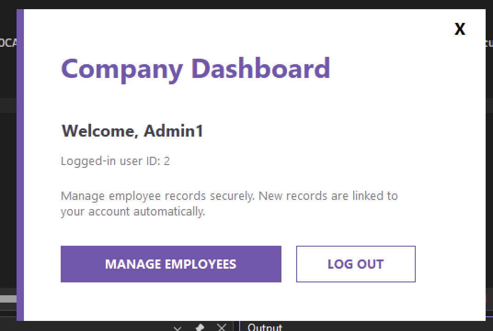
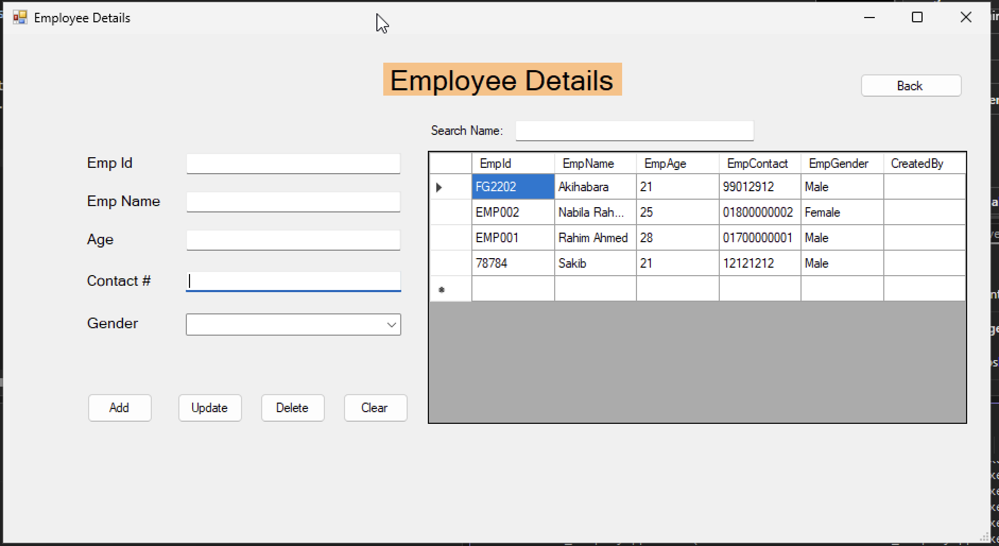
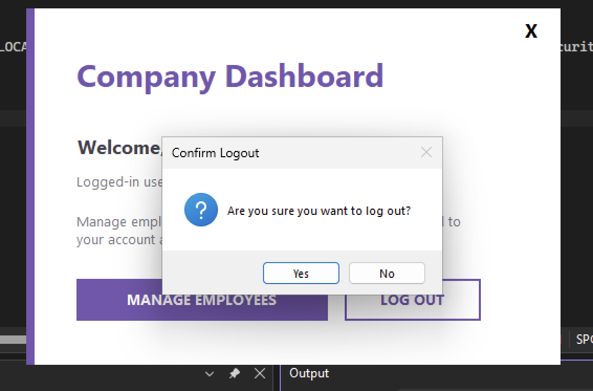

# 24-58148-2_CompanyApp

**Course:** Object-Oriented Programming 2 - Lab 2  
**Student:** MD. Nazmus Sakib  
**Student ID:** 24-58148-2  
**Database:** SQL Server LocalDB, `dbCompanyApp`  
**Repository:** `24-58148-2_CompanyApp`

## Project overview

This submission merges the existing **Login-and-Register-Master** and **EmployeeDetails (CRUD)**
applications into one Windows Forms project. The original CRUD project was
retained as the host; its employee layout, CRUD controls, data-access structure,
and original root namespace were preserved. The existing Login and Registration
interfaces were imported into that host, their authentication was migrated from
Access to SQL Server, and an authenticated Dashboard now controls access to the
Employee Management screen.

The result is one application, one entry point, one SQL Server connection string,
and one relational database. User accounts and employee records remain distinct
tables, connected through `Emp_details.CreatedBy` and `Users.UserID`.

### Before and after

| Before the merge | After the merge |
| --- | --- |
| Login-and-Register: separate Windows Forms executable | One executable: `24-58148-2_CompanyApp.exe` |
| Login data stored in an Access file under `bin/Debug` | Login data stored in `dbCompanyApp.dbo.Users` |
| EmployeeDetails: separate Windows Forms executable | Employee management opens through the authenticated Dashboard |
| Employee data stored in its own SQL Server database | Employees stored in `dbCompanyApp.dbo.Emp_details` |
| Two providers, two entry points, disconnected data | One SQL provider, one entry point, a foreign-key relationship |
| Employee rows could not identify their creators | New employees record the authenticated `Users.UserID` |



## The six original conflicts and their resolutions

### 1. Different namespaces

The imported forms originally belonged to `Login_and_Register`, while the host
project used `EmployeeDetails`. All form classes and their corresponding partial
designer classes now use the host namespace, `EmployeeDetails`. Keeping both
halves of every partial form in the same namespace restores access to
`InitializeComponent`, textboxes, event handlers, and designer-generated fields.
The root namespace was deliberately not renamed when the solution and assembly
were renamed.

### 2. Different database providers

The original login project depended on `System.Data.OleDb`; the employee project
already used `System.Data.SqlClient`. Authentication and registration were
rewritten to use `SqlConnection`, `SqlCommand`, named SQL parameters, and the
existing host-project configuration. The final C# source and project references
contain no Access-provider dependency.

### 3. Two unrelated databases

The final application uses `dbCompanyApp` exclusively. `Schema.sql` creates
`dbo.Users` and `dbo.Emp_details` inside that one database; `Migration.sql`
imports available user and employee rows from the previously working
`dbEmployeeDetails` staging database. The employee creator is now a real foreign
key instead of an unverified username string.

### 4. Different framework versions

The host EmployeeDetails project already targeted .NET Framework 4.8. That
framework was retained, allowing the older Login-and-Register forms to run
inside the newer application without introducing a second framework target.

### 5. Two `Program.cs` files / two entry points

Only the original EmployeeDetails `Program.cs` was retained. Its entry point
starts with:

```csharp
Application.Run(new frmLogin());
```

No second project, second `Main()` method, or second executable is included.

### 6. Hidden Access-file dependency

The original login application depended on an Access database stored only in
its build output. Cleaning the project removed that file and broke login. The
merged application removes that runtime dependency completely: its credentials
are stored in SQL Server, its connection is read from `App.config`, and the
repository excludes Access files and all build-output directories.

## Unified database design

Run [`Schema.sql`](Schema.sql) before opening the application. It creates:

```sql
CREATE TABLE dbo.Users
(
    UserID INT IDENTITY(1, 1) PRIMARY KEY,
    Username NVARCHAR(50) NOT NULL UNIQUE,
    Password NVARCHAR(200) NOT NULL,
    CreatedAt DATETIME NOT NULL DEFAULT GETDATE()
);

CREATE TABLE dbo.Emp_details
(
    EmpId NVARCHAR(50) PRIMARY KEY,
    EmpName NVARCHAR(100) NOT NULL,
    EmpAge INT NOT NULL,
    EmpContact NVARCHAR(20),
    EmpGender NVARCHAR(10),
    CreatedBy INT NULL,

    CONSTRAINT FK_Emp_CreatedBy
        FOREIGN KEY (CreatedBy)
        REFERENCES dbo.Users(UserID)
);
```

`Users.UserID` is generated automatically by SQL Server. `CreatedBy` remains
nullable because historical employees imported from the old CRUD database do
not have a known authenticated creator. New employees created through the
merged application receive the current `Session.UserID` automatically.

The actual script additionally creates an index on `CreatedBy` and can be run
repeatedly without deleting existing data.

### Migrating the existing data

Run [`Migration.sql`](Migration.sql) immediately after `Schema.sql`.

1. If `dbEmployeeDetails.dbo.tbl_users` exists, its usernames and passwords are
   migrated into `dbCompanyApp.dbo.Users`.
2. Plaintext passwords are converted to SHA-256; already-hashed passwords are
   not hashed a second time.
3. If `dbEmployeeDetails.dbo.Emp_details` exists, employee rows are imported
   without supplying `CreatedBy`; their creator therefore remains `NULL`.
4. If no existing user database is available, the previously verified lab
   account `AdminTest` / `1234` is created as a local demonstration account.
5. If the original Access database is available separately, use the clearly
   marked per-account migration template in `Migration.sql`. Insert only
   `Username` and `Password`; never supply `UserID`.

**Source limitation:** The provided project archive did not contain the original
Access database. Consequently, unknown original Access accounts cannot be
invented or verified. The script migrates the accounts actually available in
the working SQL Server staging database and provides the exact additional SQL
needed when the original Access accounts are supplied.

## Importing the forms: the three-file rule

Every Windows Forms screen consists of three associated files:

```text
frmLogin.cs
    frmLogin.Designer.cs
    frmLogin.resx
```

The same structure exists for `frmRegister`, `frmDashboard`, and the renamed
`frmEmployee`. The `.cs` file contains event handlers and application logic;
`.Designer.cs` contains the generated controls, layout, and partial class; and
`.resx` contains the resources expected by the Windows Forms designer.

The Login and Registration files were retained from the supplied manually
merged project, including their original controls, colors, layout, and event
handler names. Their designer and resource files are explicitly nested under
the parent form in the project file using `DependentUpon`.

The submitted archive did not include the original Dashboard source files. A
compatible three-file `frmDashboard` was therefore restored using the existing
Login/Register styling, the required Manage Employees action, and the required
logout behavior. This was the only screen missing from the supplied source; the
existing Login, Registration, and employee interfaces were not rebuilt.

## Porting authentication to SQL Server

### `User.cs`

[`User.cs`](24-58148-2_CompanyApp/User.cs) follows the same structure as the
original [`Employee.cs`](24-58148-2_CompanyApp/Employee.cs): each operation
opens a `SqlConnection` inside a `using` block, creates a parameterized
`SqlCommand`, and disposes both objects reliably.

| Method | Purpose |
| --- | --- |
| `ValidateLogin(username, password)` | Returns the matching `UserID`, or `0` if authentication fails. |
| `UsernameExists(username)` | Uses `ExecuteScalar()` to reject duplicate usernames. |
| `RegisterUser(username, password)` | Inserts the new account and returns `OUTPUT INSERTED.UserID`. |

All SQL uses named parameters. Login no longer concatenates user input into SQL,
and every attempt uses a fresh, properly disposed connection.

### `Session.cs`

[`Session.cs`](24-58148-2_CompanyApp/Session.cs) stores the authenticated
`UserID` and `Username`. Login initializes both values, the Dashboard displays
the current account, employee creation stores the ID in `CreatedBy`, and logout
calls `Session.Clear()` before presenting a fresh Login form.

### Login and Registration fixes

The Login form calls `ValidateLogin()` instead of maintaining a class-level
connection. The Registration form checks for an existing username before
calling `RegisterUser()`. Its original empty-field condition was corrected from
AND logic to OR logic so that **any** missing required field is rejected.
Password confirmation, clear buttons, password visibility checkboxes, and the
existing form layouts were retained.

## One connection string

There is exactly one configured database connection: the `connString` entry in
[`App.config`](24-58148-2_CompanyApp/App.config). Both `User.cs` and
`Employee.cs` retrieve it through:

```csharp
ConfigurationManager.ConnectionStrings["connString"].ConnectionString
```

The SQL Server instance is `(localdb)\MSSQLLocalDB`; the catalog is
`dbCompanyApp`. No temporary LocalDB named pipe or hard-coded connection string
remains in a C# source file.

## Application flow and logout behavior

1. `Program.cs` starts `frmLogin`.
2. The user can open `frmRegister`, create an account, and return to Login.
3. Successful authentication stores the numeric ID and username in `Session`.
4. `frmLogin` opens `frmDashboard` and hides itself.
5. Dashboard opens `frmEmployee` with `ShowDialog()`.
6. Employee CRUD returns to Dashboard when its existing Back button is pressed.
7. Dashboard logout requests Yes/No confirmation.
8. Confirmed logout clears the session, shows a new cleared Login form, and
   closes Dashboard.
9. Closing Login exits the message loop, preventing an invisible orphan process.

The explicit fresh Login form avoids the hidden-form trap: a hidden startup form
still exists even though it is not visible, so simply closing Dashboard would
otherwise leave an invisible application process running.

## Linking employee records to their creators

When an employee is added:

```csharp
employee.CreatedBy = Session.UserID;
```

`Employee.cs` includes that value in its parameterized insert. The grid reads
the creator through:

```sql
SELECT
    e.EmpId,
    e.EmpName,
    e.EmpAge,
    e.EmpContact,
    e.EmpGender,
    u.Username AS CreatedBy
FROM dbo.Emp_details AS e
LEFT JOIN dbo.Users AS u
    ON e.CreatedBy = u.UserID;
```

`LEFT JOIN` is required because migrated employee rows have `CreatedBy = NULL`.
An inner join would silently remove those historical employees from the grid.
The row-selection handler reads cells by column **name**, not numeric index, so
adding the `CreatedBy` column does not break editing:

```csharp
selectedRow.Cells["EmpName"].Value
```

## Real integration errors and their fixes

**Blank imported forms and missing designer controls.** Initially, the imported
designer/resource files appeared as independent files instead of nesting under
their corresponding forms. The UI was blank and generated textbox fields were
unavailable. The issue was fixed by keeping each form's `.cs`, `.Designer.cs`,
and `.resx` together and adding the appropriate `DependentUpon` metadata.

**Dashboard type missing.** Removing the original Dashboard while retaining a
`new frmDashboard()` reference produced the compiler error: `The type or
namespace name 'frmDashboard' could not be found`. Restoring the required
Dashboard and including all three associated files resolved it.

**Connection variable outside its scope.** During the database-provider port,
an old `con.Open()` remained after its class-level Access connection had been
removed, producing `The name 'con' does not exist in the current context`.
Moving all connection ownership into the `User.cs` data-access methods removed
the invalid reference and guaranteed disposal.

## Why one database is better than two

A single database allows user accounts and employee records to share one
consistent relational schema. The `CreatedBy` foreign key ensures that a new
employee can reference only a valid account, which two unrelated database
engines could not enforce. A single `LEFT JOIN` can immediately display the
creator's username while still preserving migrated employees whose creator is
unknown. One connection string also simplifies deployment, troubleshooting,
backup, and permissions because the application no longer depends on a hidden
Access file. Together, these changes make the merged application easier to
maintain and considerably less likely to lose or contradict its data.

## Bonus features

### Bonus 1: SHA-256 password hashing

[`PasswordHelper.cs`](24-58148-2_CompanyApp/PasswordHelper.cs) hashes passwords
before registration and authentication. The migration script hashes historical
plaintext values with SQL Server `HASHBYTES`. Both implementations use the same
UTF-16LE representation so migrated users can log in successfully.

### Bonus 2: Search-by-name and delete confirmation

The employee screen includes an incremental name-search textbox.
`Employee.SearchEmployees()` uses a parameterized `LIKE @SearchTerm` query and
retains the same creator-displaying left join. Deleting any employee requires a
Yes/No confirmation before its parameterized `DELETE` executes.

## Solution structure

```text
24-58148-2_CompanyApp/
|-- 24-58148-2_CompanyApp.sln
|-- Schema.sql
|-- Migration.sql
|-- README.md
|-- MERGE_PROGRESS.md
|-- SUBMISSION_CHECKLIST.md
|-- Report.pdf
|-- .gitignore
|-- Screenshots/
|   `-- README.md
`-- 24-58148-2_CompanyApp/
    |-- 24-58148-2_CompanyApp.csproj
    |-- App.config
    |-- Program.cs
    |-- Employee.cs
    |-- User.cs
    |-- Session.cs
    |-- PasswordHelper.cs
    |-- frmLogin.cs / frmLogin.Designer.cs / frmLogin.resx
    |-- frmRegister.cs / frmRegister.Designer.cs / frmRegister.resx
    |-- frmDashboard.cs / frmDashboard.Designer.cs / frmDashboard.resx
    `-- frmEmployee.cs / frmEmployee.Designer.cs / frmEmployee.resx
```


### Unified database and both tables



### Migrated user accounts



### Single project and nested form files



### Login screen



### Registration screen



### Authenticated Dashboard



### Employee grid showing the creator



### Logout confirmation and cleared Login



### Bonus employee search


